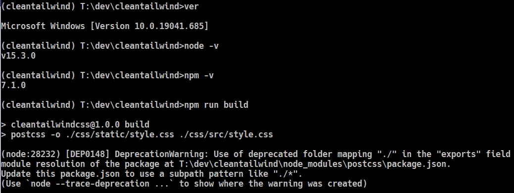

# postcss-1455-deprecation-warning
Small repository to reproduce deprecation warning thrown by node.js while using postcss
## Background
While setting up a new project that uses [TailwindCSS](https://tailwindcss.com/), I came across a prominent-multi-lines warning during an npm run as follows:
```
(node:24892) [DEP0148] DeprecationWarning: Use of deprecated folder mapping "./" in the "exports" field module resolution of the package at T:\dev\cleantailwind\node_modules\postcss\package.json.
Update this package.json to use a subpath pattern like "./*".
(Use `node --trace-deprecation ...` to show where the warning was created)
```
As I give in to my OCD (it is just a warning, all process done without a hitch), I found the author's open issue exactly on this matter on [PostCSS issue 1455](https://github.com/postcss/postcss/issues/1455) postcss/postcss#1455

## The (Pending) Solution
The problem was drilled down to a subpath pattern definition in postcss' package.json in line #14
```
     "./": "./"
```
Changing the line to `"./*": "./*"` or inserting `"./*": "./*",` before line 14 (as suggested by the conversation on that issue) seemed indeed muted the warning. BUT it then produced an ERROR instead that the module needed cannot be found. The module in particular can be varied depending of which one you use, but in my case, "fixing" the warning above is giving me the following error:
```
Error: Loading PostCSS Plugin failed: Cannot find module 'T:\dev\cleantailwind\node_modules\postcss\lib\node'
(@T:\dev\cleantailwind\postcss.config.js)
    at load (T:\dev\cleantailwind\node_modules\postcss-load-config\src\plugins.js:28:11)
    at T:\dev\cleantailwind\node_modules\postcss-load-config\src\plugins.js:53:16
    at Array.map (<anonymous>)
    at plugins (T:\dev\cleantailwind\node_modules\postcss-load-config\src\plugins.js:52:8)
    at processResult (T:\dev\cleantailwind\node_modules\postcss-load-config\src\index.js:33:14)
    at T:\dev\cleantailwind\node_modules\postcss-load-config\src\index.js:94:14
    at async Promise.all (index 0)
npm ERR! code 1
npm ERR! path T:\dev\cleantailwind
npm ERR! command failed
```
However according to https://nodejs.org/api/packages.html#packages_subpath_exports the (pending) solution is to change the line to:
`"./*": "./*.js"`

Hopefully it can finally put this issue to its conclusion. We wait.

## Usage
To reproduce the error message simply clone this repo:
`git clone https://github.com/ozbigcat/postcss-1455-deprecation-warning.git`
`npm install`
`npm run build`

Then you should see the warning. 

### Environment
* Windows 10
* Node 15.3.0
* npm 7.1.0
* autoprefixer 10.1.0
* postcss 8.2.1
* postcss-cli 8.3.1
* tailwindcss 2.0.2


